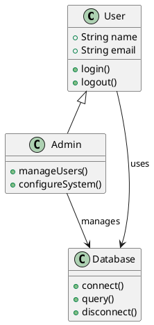
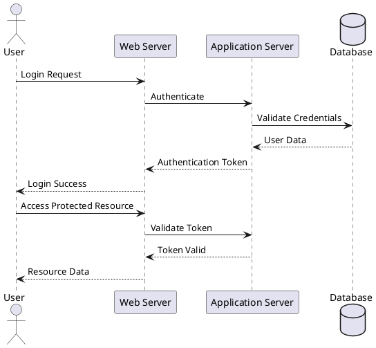
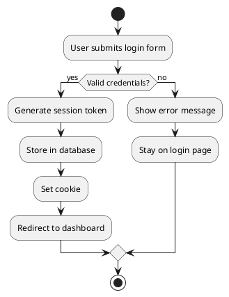
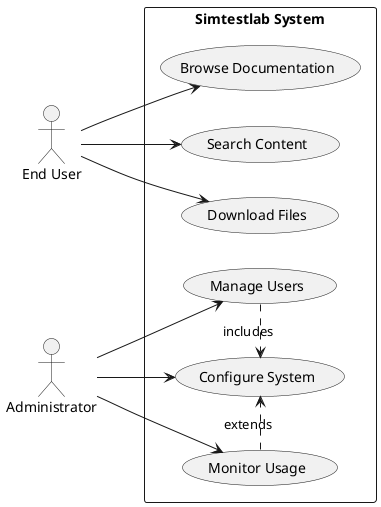
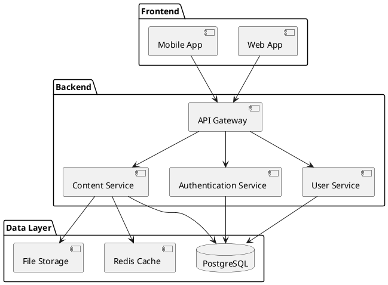
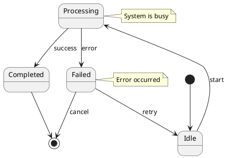
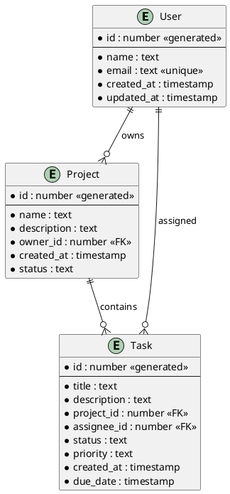

# Diagrams

This page demonstrates various PlantUML diagrams that can be used in your documentation.

## Class Diagram

## Sequence Diagram

## Activity Diagram

## Use Case Diagram

## Component Diagram

## State Diagram

## Entity Relationship Diagram

These diagrams are rendered using PlantUML and can help visualize system architecture, workflows, and relationships in your documentation.